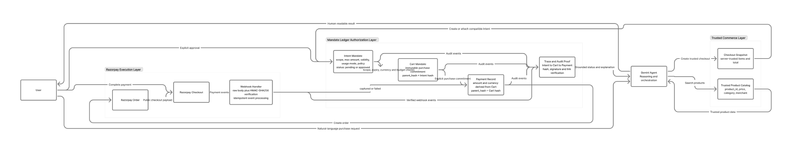
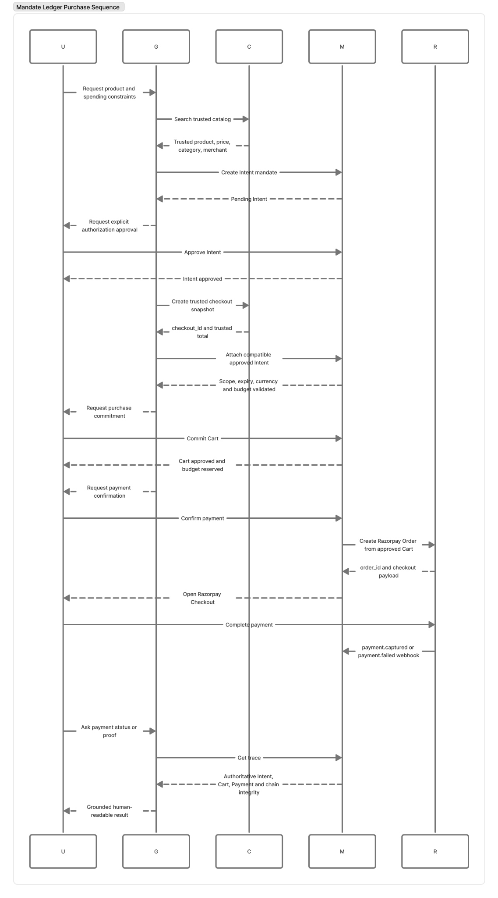

# Mandate Ledger

> **An AP2-inspired authorization and audit layer for AI-agent commerce on Razorpay Test Mode.**

Mandate Ledger is a fintech-oriented trust layer that sits between an AI shopping agent and Razorpay. It ensures that an agent can only execute a purchase when the user has explicitly authorized the **scope**, **maximum amount**, **validity period**, and **usage mode** of that purchase authority.

The system separates responsibilities deliberately:

- **Gemini** interprets user intent and orchestrates trusted tools.
- **Mandate Ledger** validates, authorizes, records, and proves every financial action.
- **Razorpay** executes the payment.
- **Verified webhooks + transaction trace** provide the authoritative final payment state.

> **Core principle:** The agent may propose an action, but it never becomes the source of financial truth.

---

## Table of Contents

- [Problem Statement](#problem-statement)
- [Solution Overview](#solution-overview)
- [System Architecture](#system-architecture)
- [End-to-End Purchase Sequence](#end-to-end-purchase-sequence)
- [Core Domain Model](#core-domain-model)
- [Authorization Modes](#authorization-modes)
- [Trusted Commerce Layer](#trusted-commerce-layer)
- [Structured Scope Policies](#structured-scope-policies)
- [Cryptographic Mandate Chain](#cryptographic-mandate-chain)
- [Budget Reservation Model](#budget-reservation-model)
- [Payment Execution and Webhooks](#payment-execution-and-webhooks)
- [Trace and Audit Proof](#trace-and-audit-proof)
- [AI Agent Safety Boundary](#ai-agent-safety-boundary)
- [Risk Model and Mitigations](#risk-model-and-mitigations)
- [API Surface](#api-surface)
- [Project Structure](#project-structure)
- [Tech Stack](#tech-stack)
- [Why Node.js](#why-nodejs)
- [Razorpay and Vulcan Positioning](#razorpay-and-vulcan-positioning)
- [Local Setup](#local-setup)
- [Environment Variables](#environment-variables)
- [Running the Project](#running-the-project)
- [Razorpay Webhook Setup](#razorpay-webhook-setup)
- [Manual E2E Acceptance Tests](#manual-e2e-acceptance-tests)
- [Demo Flow](#demo-flow)
- [Security Properties](#security-properties)
- [Known MVP Limitations](#known-mvp-limitations)
- [Production Roadmap](#production-roadmap)
- [Hackathon Pitch](#hackathon-pitch)

---

# Problem Statement

AI agents can already call APIs, select products, and initiate payments. The harder problem is **delegated authority**.

If a user tells an AI agent:

> “You can spend up to ₹10,000 on Footwear until tomorrow evening.”

the payment system still needs deterministic answers to questions such as:

1. Did the user explicitly approve this authority?
2. Is the requested product actually inside the approved scope?
3. Is the authorization still valid?
4. Has cumulative spend already consumed the available budget?
5. Is product price coming from a trusted source or from the LLM/browser?
6. If payment fails, can the same purchase be retried without double-reserving the budget?
7. Can the full authorization → purchase → payment history be reconstructed and verified later?

A normal LLM-to-payment integration does not provide these guarantees by itself.

---

# Solution Overview

Mandate Ledger inserts a deterministic authorization layer between the AI agent and Razorpay.

```text
User
  ↓
Gemini Agent
  ↓
Trusted Commerce
  ↓
Mandate Ledger
  ↓
Razorpay
  ↓
Verified Webhook
  ↓
Trace / Audit Proof
  ↓
User
```

| Layer | Responsibility |
|---|---|
| Gemini Agent | Understand user language, search trusted catalog, select tools, explain results |
| Trusted Commerce | Resolve server-owned product, price, category, merchant, and checkout snapshot |
| Mandate Ledger | Enforce consent, scope, expiry, usage mode, cumulative budget, and cryptographic linkage |
| Razorpay | Create Orders and execute Test Mode payments |
| Webhook + Trace | Establish authoritative payment truth and reconstruct the mandate chain |

---

# System Architecture

<p align="center">
  
</p>

The architecture is divided into three primary trust zones:

### 1. Trusted Commerce Layer
Provides authoritative product data and creates short-lived checkout snapshots.

### 2. Mandate Ledger Authorization Layer
Owns Intent, Cart, Payment, spend-cap, scope, signature, audit, and trace logic.

### 3. Razorpay Execution Layer
Creates the Razorpay Order, opens Checkout, and returns payment events through verified webhooks.

A useful mental model is:

```text
Gemini proposes
Mandate Ledger authorizes and proves
Razorpay executes
```

---

# End-to-End Purchase Sequence

<p align="center">
  
</p>

A successful purchase follows this lifecycle:

```text
User purchase request
        ↓
Gemini searches trusted catalog
        ↓
Backend returns product_id, price, category, merchant
        ↓
Intent Mandate created
        ↓
Explicit user approval
        ↓
Trusted checkout snapshot created
        ↓
Existing compatible Intent attached or new Intent created
        ↓
Scope + expiry + currency + budget validation
        ↓
Cart Mandate committed
        ↓
Budget reserved
        ↓
Explicit payment confirmation
        ↓
Razorpay Order created
        ↓
Razorpay Checkout
        ↓
payment.captured / payment.failed webhook
        ↓
Webhook signature verification
        ↓
Payment state finalized
        ↓
GET /trace/:trace_id
        ↓
Human-readable grounded result
```

---

# Core Domain Model

Mandate Ledger uses a three-stage authorization chain:

```text
Intent → Cart → Payment
```

## Intent Mandate

The Intent represents **what the user has authorized**.

Typical fields include:

```text
scope
max_amount
currency
valid_until
usage_mode
policy_json
status
mandate_hash
signature
trace_id
```

Example:

```json
{
  "scope": "Footwear purchases",
  "max_amount": 1000000,
  "currency": "INR",
  "usage_mode": "reusable_budget",
  "policy": {
    "categories": ["Footwear"]
  },
  "status": "approved"
}
```

> Monetary values are stored internally in the smallest currency unit. For INR, ₹10,000 is stored as `1000000` paise.

## Cart Mandate

A Cart represents an **exact immutable purchase commitment**.

A Cart is created only after the backend validates:

- Intent exists
- Intent is explicitly approved
- Intent is not expired
- Currency matches
- Structured scope policy matches
- Cumulative budget is sufficient
- Trusted checkout data is valid

Each new purchase receives a new Cart.

```text
Reusable Intent
 ├── Cart 1
 ├── Cart 2
 ├── Cart 3
 └── ...
```

Previously committed Carts are never modified to represent later purchases.

## Payment Record

A Payment represents execution of one approved Cart.

The payment service derives the trusted:

```text
amount
currency
cart_id
trace_id
```

from the Cart.

The browser or Gemini does not get to redefine the amount at payment time.

---

# Authorization Modes

## `single_use`

One approved Cart is allowed.

```text
Maximum authorization: ₹5,000
Cart #1: ₹1,999  → allowed
Cart #2: ₹500    → rejected
```

Once the first Cart is committed, the authorization is logically consumed even if there is a nominal arithmetic remainder.

## `reusable_budget`

Multiple independent Carts are allowed until cumulative authorization is exhausted.

```text
Intent maximum: ₹10,000

Cart #1 = ₹2,599
Cart #2 = ₹1,999
Cart #3 = ₹3,499

Committed = ₹8,097
Available = ₹1,903
```

A new ₹1,999 purchase is rejected because it exceeds the remaining authorization.

The backend computes cumulative commitment from approved Carts. Gemini does **not** send cumulative Cart amounts.

---

# Trusted Commerce Layer

The AI agent is not allowed to invent product truth.

For catalog purchases, the backend controls:

```text
product_id
name
price
category
merchant
currency
```

A typical agent flow is:

```text
User:
"Find me wireless earbuds around ₹2,500."

        ↓

Gemini:
search_products(...)

        ↓

Trusted catalog:
Echo Wireless Earbuds
₹2,499
Electronics
Echo Audio
```

The selected product is converted into a short-lived trusted checkout snapshot containing trusted items, total, category, merchant, currency, and expiry.

## Price Tampering Protection

If a client attempts:

```json
{
  "product_id": "shoe_001",
  "quantity": 1,
  "price": 1
}
```

the backend ignores the untrusted price and uses the server-owned catalog price.

---

# Structured Scope Policies

The human-readable Intent scope is accompanied by structured policy.

Supported policy dimensions include:

```json
{
  "categories": ["Footwear"],
  "merchant_ids": [],
  "product_ids": []
}
```

Example:

```text
Intent:
Allowed category = Footwear

Trusted product:
Echo Wireless Earbuds
Category = Electronics

Result:
Purchase blocked
```

The failed attempt does not create a Cart, does not initiate a payment, and does not consume additional authorization.

---

# Cryptographic Mandate Chain

Every mandate has its own hash/signature and references the hash of its parent.

```text
Intent
hash = A
   │
   ▼
Cart
parent_hash = A
hash = B
   │
   ▼
Payment
parent_hash = B
hash = C
```

A foreign key proves:

```text
Payment belongs to Cart X
```

The hash chain additionally enables verification that the referenced mandate state has not been silently changed without detection.

The trace service re-validates:

- mandate hashes
- signatures
- Intent → Cart links
- Cart → Payment links
- trace consistency

and exposes a chain-integrity result.

---

# Budget Reservation Model

Budget is reserved at **Cart commitment**, not at payment capture.

```text
Intent max = ₹10,000
Cart = ₹2,499

Committed = ₹2,499
Available = ₹7,501
```

This prevents concurrent exposure.

Without Cart-time reservation:

```text
Remaining = ₹5,000
Purchase A = ₹4,000
Purchase B = ₹4,000
```

both requests could appear valid before either payment captures.

Mandate Ledger instead reserves the first committed Cart before evaluating the next one.

---

# Payment Execution and Webhooks

After a Cart is committed, the user explicitly confirms payment.

The payment service:

1. Loads the approved Cart.
2. Derives amount and currency from trusted backend state.
3. Creates/reuses the payment execution record.
4. Calls the Razorpay adapter.
5. Creates a Razorpay Test Mode Order.
6. Returns public Checkout configuration.

The server never sends Razorpay secrets to the browser.

## Razorpay Webhook Verification

The webhook endpoint requires the raw request body for signature verification.

Conceptually:

```text
Razorpay webhook
      ↓
raw request body
      ↓
HMAC-SHA256 verification
      ↓
valid signature?
 ├── no  → reject
 └── yes → process event
```

Supported execution outcomes include:

```text
payment.captured
payment.failed
```

Browser callback state is not treated as the final source of payment truth.

## Webhook Idempotency

Provider events are persisted with a unique event identifier.

Repeated delivery of the same webhook does not create a duplicate financial transition.

---

# Payment Failure and Safe Retry

A failed payment does not release the Cart reservation automatically.

```text
Cart committed: ₹2,499

Payment:
FAILED

Committed:
₹2,499

Available:
₹7,501
```

Retrying the same logical purchase reuses the same Cart reservation.

If retry succeeds:

```text
Cart count remains 1
Committed remains ₹2,499
Payment becomes captured
```

The amount is not reserved twice.

---

# Trace and Audit Proof

`GET /trace/:trace_id` reconstructs the transaction graph.

For reusable authorizations:

```text
                  Intent
                    │
        ┌───────────┼───────────┐
        ▼           ▼           ▼
      Cart 1      Cart 2      Cart 3
        │           │           │
        ▼           ▼           ▼
    Payment 1   Payment 2   Payment 3
```

The trace includes:

- Intent state
- Cart commitments
- Payment executions
- aggregate authorization totals
- failure information
- audit timeline
- signature/link verification
- cryptographic chain integrity

The AI uses this trusted trace for grounded transaction explanations.

---

# AI Agent Safety Boundary

Gemini is intentionally not the payment authority.

Gemini may:

- understand natural-language purchase requests
- search trusted products
- ask for missing expiry information
- create tool proposals
- select a compatible authorization through the trusted workflow
- explain backend results
- request trace information

Gemini may not:

- approve an Intent on its own
- bypass an expired/pending Intent
- override scope policy
- override cumulative budget
- invent trusted catalog prices
- mark a payment captured from browser state
- silently convert `single_use` into `reusable_budget`
- create a replacement authorization without separate consent when the user explicitly requires reuse

The design rule is:

```text
LLM reasoning != financial authority
```

---

# Confirmation Gates

The user explicitly confirms important financial state transitions.

```text
1. Approve authorization
2. Confirm purchase commitment
3. Confirm payment
```

Internal compatibility checks are backend operations and are not themselves treated as new user authority.

---

# Risk Model and Mitigations

| Risk | Mitigation |
|---|---|
| LLM invents product price | Trusted backend catalog |
| Client price tampering | Server resolves price from `product_id` |
| Wrong-category purchase | Structured category policy |
| Spend-cap bypass | Cumulative committed Cart calculation |
| Single-use replay | Reject second committed Cart |
| Pending Intent spend | `INTENT_NOT_APPROVED` enforcement |
| Expired Intent spend | `valid_until` enforcement |
| Duplicate Cart commitment | Checkout/Cart idempotency protection |
| Duplicate payment initiation | Reuse existing active payment/order |
| Failed-payment double reservation | Retry same Cart, no second reservation |
| Browser false success | Webhook/trace is authoritative |
| Webhook spoofing | HMAC verification over raw body |
| Duplicate webhook | Unique provider event id |
| Mandate tampering | Hash/signature/parent-link verification |
| Wrong active Intent | Session-owned multi-Intent compatibility resolution |

---

# API Surface

The application exposes three main API groups.

## Mandate Core

```http
POST   /intent
PATCH  /intent/:id/approve
POST   /cart
POST   /pay
GET    /trace/:trace_id
POST   /webhook
```

## Trusted Commerce

```http
GET/POST /products
POST     /commerce/checkout-preview
GET      /commerce/checkout/:checkoutId
POST     /commerce/checkout/:checkoutId/intent
POST     /commerce/checkout/:checkoutId/attach-intent
POST     /commerce/checkout/:checkoutId/approve-intent
POST     /commerce/checkout/:checkoutId/cart
POST     /commerce/checkout/:checkoutId/payment
```

## Conversational Agent

```http
POST /chat
```

The chat orchestrator maps Gemini tool calls to deterministic backend services and tracks trusted session state.

---

# Project Structure

```text
mandate-ledger/
├── .env
├── .env.example
├── package.json
├── server.js
│
├── db/
│   ├── db.js
│   ├── schema.sql
│   └── mandate_ledger.db          # local runtime only; do not commit
│
├── data/
│   └── products.js                # trusted demo catalog
│
├── routes/
│   ├── intent.js
│   ├── cart.js
│   ├── pay.js
│   ├── webhook.js
│   ├── trace.js
│   ├── chat.js
│   ├── commerce.js
│   └── ...
│
├── services/
│   ├── consentManager.js
│   ├── spendCapController.js
│   ├── scopePolicyService.js
│   ├── commerceMandateBridge.js
│   ├── checkoutSessionService.js
│   ├── paymentService.js
│   ├── razorpayAdapter.js
│   ├── ledger.js
│   ├── traceService.js
│   ├── geminiService.js
│   ├── chatOrchestrator.js
│   └── ...
│
├── frontend/
│   ├── src/
│   │   ├── pages/
│   │   ├── components/
│   │   ├── services/
│   │   └── types/
│   └── ...
│
├── docs/
│   └── images/
│       ├── mandate-ledger-architecture.png
│       └── mandate-ledger-purchase-sequence.png
│
└── README.md
```

---

# Important Service Responsibilities

| Service | Responsibility |
|---|---|
| `consentManager.js` | Intent and Cart lifecycle rules |
| `spendCapController.js` | Cumulative authorization validation |
| `scopePolicyService.js` | Category/product/merchant policy checks |
| `checkoutSessionService.js` | Short-lived trusted checkout snapshots |
| `commerceMandateBridge.js` | Trusted commerce ↔ mandate binding |
| `paymentService.js` | Payment lifecycle and retry/idempotency logic |
| `razorpayAdapter.js` | Razorpay SDK boundary |
| `ledger.js` | Hashing/signing/audit responsibilities |
| `traceService.js` | Transaction graph and integrity verification |
| `geminiService.js` | Gemini SDK, tool definitions, prompt and tool history |
| `chatOrchestrator.js` | Session state, tool execution, confirmation gates, multi-Intent resolution |

---

# Tech Stack

## Backend

- Node.js
- Express
- ES Modules
- SQLite
- `better-sqlite3`
- Razorpay Node SDK
- JWT
- SHA-256 / HMAC via Node `crypto`
- `@google/genai`

## Frontend

- React
- TypeScript
- Vite
- Tailwind CSS
- React Router
- `react-markdown`
- Razorpay Checkout

## External Systems

- Razorpay Test Mode
- Gemini
- Public HTTPS tunnel during local webhook testing

---

# Why Node.js

Python/FastAPI would also be a valid implementation choice.

Node.js was selected because this MVP is primarily an orchestration and I/O workload:

```text
Gemini requests
Razorpay API requests
webhooks
HTTP APIs
database writes
trace reads
```

The frontend already uses React/TypeScript, so Node reduces context switching during a short hackathon development cycle.

Razorpay-specific logic is isolated behind `razorpayAdapter.js`, preventing provider-specific code from spreading through business services.

### MVP Trade-off

`better-sqlite3` is intentionally simple for a local prototype.

For production scale, persistence should move to a server-grade relational database such as PostgreSQL and session/idempotency state should become durable/distributed.

---

# Razorpay and Vulcan Positioning

Mandate Ledger does **not** claim a direct private integration with Razorpay Vulcan.

The architectural positioning is complementary:

```text
Mandate Ledger
Application-level delegated authority
        ↓
Razorpay
Payment execution / payment-network intelligence
```

Mandate Ledger answers:

> “Was this agent actually authorized to make this purchase?”

Razorpay remains responsible for payment execution and the intelligence available within Razorpay's own infrastructure.

---

# Local Setup

## Prerequisites

- Node.js
- npm
- Git
- Razorpay Test Mode account
- Gemini API access
- Optional public HTTPS tunnel for webhook testing

## Clone

```bash
git clone <YOUR_REPOSITORY_URL>
cd mandate-ledger
```

## Backend Dependencies

```bash
npm install
```

## Frontend Dependencies

```bash
cd frontend
npm install
cd ..
```

---

# Environment Variables

Create `.env` from `.env.example`.

```env
PORT=3000
NODE_ENV=development

RAZORPAY_KEY_ID=
RAZORPAY_KEY_SECRET=
RAZORPAY_WEBHOOK_SECRET=

JWT_SECRET=

DB_PATH=./db/mandate_ledger.db

GEMINI_API_KEY=
GEMINI_MODEL=
```

> Never commit `.env` or real credentials.

---

# Recommended `.gitignore`

```gitignore
.env
.env.*
!.env.example

node_modules/
frontend/node_modules/

frontend/dist/
dist/

db/*.db
db/*.db-wal
db/*.db-shm

*.log
logs/

.DS_Store
.idea/
```

---

# Running the Project

## Backend

```bash
npm run dev
```

Expected:

```text
Backend: http://localhost:3000
Health:  http://localhost:3000/health
```

Verify:

```http
GET http://localhost:3000/health
```

## Frontend

In another terminal:

```bash
cd frontend
npm run dev
```

Open the Vite URL shown in the terminal.

---

# Common Port 3000 Fix

Windows PowerShell:

```powershell
Get-NetTCPConnection -LocalPort 3000 -State Listen
```

Then:

```powershell
Get-Process -Id <PID>
Stop-Process -Id <PID> -Force
```

Or, when safe:

```powershell
Stop-Process -Name node -Force
```

Restart:

```powershell
npm run dev
```

---

# Razorpay Webhook Setup

Localhost cannot directly receive public Razorpay webhooks.

Expose the backend with a public HTTPS tunnel and configure the Razorpay Test Mode webhook to point to:

```text
https://<public-tunnel>/webhook
```

Use the same webhook secret stored in:

```env
RAZORPAY_WEBHOOK_SECRET=
```

The backend verifies the webhook signature before processing the event.

---

# Manual E2E Acceptance Tests

The MVP has been manually validated through eight end-to-end scenarios.

| # | Scenario | Expected Invariant | Status |
|---|---|---|---|
| 1 | Reusable authorization + multiple Carts | Every purchase gets its own Cart; cumulative budget derived server-side | ✅ PASS |
| 2 | Electronics product under Footwear Intent | Scope violation blocked; no Cart/payment/budget consumption | ✅ PASS |
| 3 | Correct scope but purchase exceeds remaining budget | Cumulative cap blocks purchase; state unchanged | ✅ PASS |
| 4 | Multiple active Intents | Correct compatible Intent selected; independent budgets | ✅ PASS |
| 5 | Single-use authorization | First Cart succeeds; second Cart rejected | ✅ PASS |
| 6 | Payment failure + retry | Same Cart reused; no double reservation; final capture succeeds | ✅ PASS |
| 7 | Pending Intent purchase | No implicit approval; no Cart/payment | ✅ PASS |
| 8 | Expired Intent purchase | Expired authority cannot spend | ✅ PASS |

> Current limitation: these are manual E2E acceptance tests. A future production-ready version should convert critical cases into an automated regression suite.

---

# Demo Flow

### 1. Create authorization

```text
Create a reusable authorization of ₹8,000 INR only for Electronics purchases.
```

Approve it.

### 2. Trusted purchase

```text
Find the Echo Wireless Earbuds and buy one pair using this authorization.
```

Confirm purchase.

### 3. Show budget state

```text
Committed: ₹2,499
Available: ₹5,501
```

### 4. Confirm Razorpay payment

Complete Razorpay Test Mode Checkout.

### 5. Show transaction proof

```text
Payment successful
Transaction integrity verified
```

### 6. Attempt policy violation

```text
Buy Urban Pace Sneakers using the same Electronics authorization.
```

Expected:

```text
Purchase blocked
Authorized category: Electronics
Requested category: Footwear
```

This demonstrates both the happy path and one explicit failure path.

---

# Security Properties

Mandate Ledger is designed around these invariants:

```text
No implicit authorization
No LLM-controlled trusted pricing
No spend beyond remaining budget
No cross-scope purchase
No reuse of consumed single-use authority
No spending from pending authority
No spending from expired authority
No browser-only final payment truth
No duplicate webhook transition
No duplicate budget reservation on payment retry
No silent mutation of earlier Cart commitments
```

---

# State Model

## Intent

```text
PENDING
   │
   │ explicit user approval
   ▼
APPROVED
   │
   │ valid_until passes
   ▼
EXPIRED (effective state)
```

For `single_use`:

```text
APPROVED
   │
   │ first Cart committed
   ▼
CONSUMED
```

For `reusable_budget`:

```text
APPROVED
   │
   ├── Cart 1
   ├── Cart 2
   ├── ...
   │
   ▼
FULLY COMMITTED
when available authorization reaches zero
```

## Payment

```text
CREATED
  ├──────────────► FAILED
  │                  │
  │                  │ retry same Cart
  │                  ▼
  └──────────────► CAPTURED
```

---

# UI / UX

The frontend includes:

- product browsing
- trusted Cart
- AI Assistant
- authorization confirmation cards
- purchase confirmation
- payment confirmation
- Razorpay Checkout
- success/failure payment states
- scope/cap policy violation cards
- reusable authorization summaries
- transaction proof dashboard

Normal customer-facing UI should hide internal IDs, raw hashes, secrets, and smallest-unit currency values unless technical/debug information is explicitly requested.

---

# Known MVP Limitations

- SQLite is local and not horizontally scalable.
- Chat/session state is not yet backed by Redis or another distributed store.
- Checkout snapshots are short-lived and process-local.
- No production-grade multi-tenant ownership model is claimed.
- No live-mode production payments are intended.
- No full RBI/KYC/compliance implementation is claimed.
- No production fraud model is included.
- Automated regression tests should replace the manual E2E suite.
- Multi-merchant checkout is intentionally restricted.
- Authorization release/cancellation after an abandoned committed Cart is future work.
- Razorpay Vulcan is not directly called by this application.

---

# Production Roadmap

```text
SQLite
   ↓
PostgreSQL

In-memory sessions
   ↓
Redis / durable session store

Local checkout snapshots
   ↓
Persistent checkout session table

Manual E2E tests
   ↓
Automated unit + integration + contract + webhook tests

Demo identity/session model
   ↓
Authenticated multi-tenant ownership

Single instance
   ↓
Stateless horizontally scaled API

Local observability
   ↓
Structured logs + metrics + distributed tracing
```

Further work:

- Cart release/revocation lifecycle
- richer authorization policies
- merchant-specific mandates
- policy versioning
- automated webhook replay testing
- production-grade secrets management
- OpenAPI documentation
- distributed locking/idempotency
- stronger key management for mandate signatures

---

# Hackathon Pitch

## One-line pitch

> **Mandate Ledger is a trust layer that lets AI agents shop with bounded, explicit, auditable authority before Razorpay executes the payment.**

## Technical pitch

```text
Agent reasoning
      ↓
Trusted catalog
      ↓
Explicit Intent authorization
      ↓
Immutable Cart commitment
      ↓
Cumulative scope/budget validation
      ↓
Razorpay execution
      ↓
Verified webhook truth
      ↓
Cryptographic transaction proof
```

## Why it matters

The project addresses a key agentic-commerce question:

> How do we give an AI enough authority to transact without giving it unrestricted control over money?

Mandate Ledger answers with:

```text
explicit consent
bounded scope
bounded spend
time-bounded authority
trusted commerce data
immutable commitments
payment idempotency
failure handling
cryptographic auditability
```

---

# Final Architecture Principle

```text
Gemini asks:
"What does the user want?"

Trusted Commerce asks:
"What is the product actually?"

Intent asks:
"What has the user authorized?"

Cart asks:
"What exact purchase are we committing?"

Spend Cap asks:
"Does this purchase still fit?"

Scope Policy asks:
"Is this purchase allowed?"

Razorpay asks:
"What payment should be executed?"

Webhook asks:
"What actually happened?"

Trace asks:
"Can we prove the whole chain?"
```

That separation is the foundation of Mandate Ledger.

---

## Disclaimer

Mandate Ledger is an educational/hackathon prototype built against Razorpay Test Mode. It is not a production payment gateway, does not claim production regulatory compliance, and should not be used for real-money processing without a full security, compliance, data-protection, reliability, and operational review.
